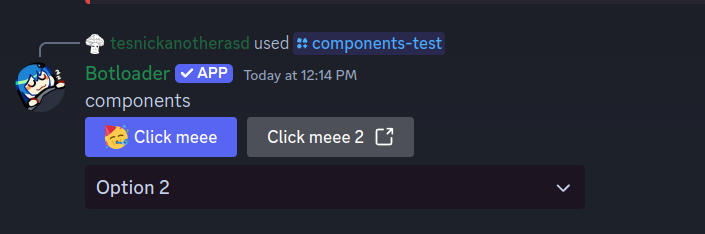

# Message components

From the discord docs (https://discord.com/developers/docs/interactions/message-components): 

>Message components—we'll call them "components" moving forward—are a framework for adding interactive elements to the messages your app or bot sends. They're accessible, customizable, and easy to use.

This is the components that can be used in messages:

- ActionRow: All components have to be within an action row
    - You can have 5 action rows per message
    - Each action row fits 5 buttons, or 1 select menu / text input (modal only)
- UrlButton: Basically a link to a webpage
- CustomButton: Button you can add a event handler to for custom behavior (more on that later)
- SelectMenu / UserSelectMenu / ChannelSelectMenu / RoleSelectMenu / MentionableSelectMenu
    - "Mentionable" means users can submit either roles or users
    - To turn a select into a multi select use `.setMaxValues(...)` with a number above 1
    - Select menus take up an entire action row

### Handling interactions

See [handling interactions](./interactions_handling.md).

### Brief example

Here is an example of a message with a button and select menu components:



Code for the above: 
```ts
import { Commands, Discord, HttpClient, Tasks } from 'botloader';

script.createSlashCommand("components-test", "Test command for components")
    .build(async (ctx, args) => {
        const botUser = Discord.getBotUser()

        await ctx.createFollowup({
            content: `components`,
            components: [
                new Discord.ActionRow([
                    new Discord.CustomButton("Click meee", "test-button").setStyle("Primary").setEmoji({ unicode: "🥳" }),
                    new Discord.UrlButton("Click meee 2", "https://botloader.io"),
                ]),
                new Discord.ActionRow([
                    new Discord.SelectMenu("text-select", [
                        new Discord.SelectMenuOption("Option 1", "Value 1"),
                        new Discord.SelectMenuOption("Option 2", "Value 2").setDefault(true),
                        new Discord.SelectMenuOption("Option 3", "Value 3"),
                    ])
                ]),
            ]
        })
    })

script.onInteractionSelectMenu("text-select", async (interaction) => {
    await interaction.ackWithMessage({
        content: "Data submitted: \n```json\n" + JSON.stringify(interaction.values) + "\n```"
    })
})

script.onInteractionButton("test-button", async (interaction) => {
    await interaction.ackWithMessage({
        content: "You clicked the button"
    })
})
```

